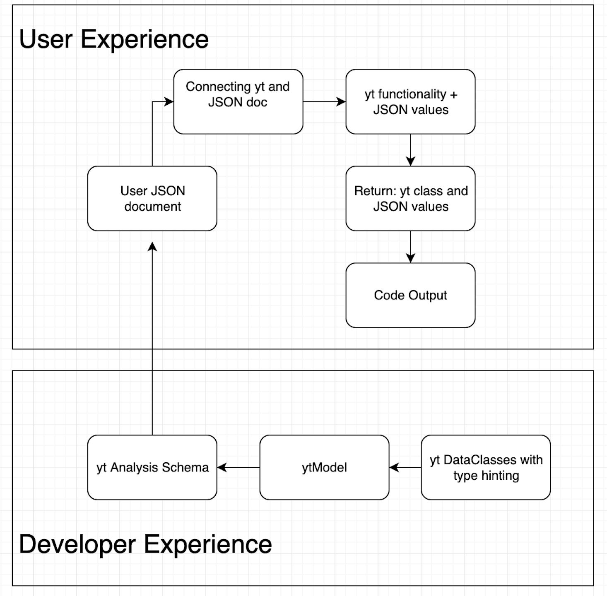
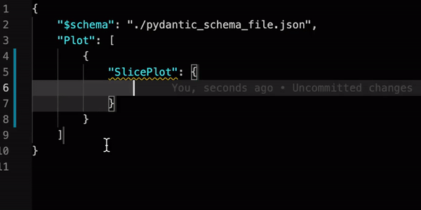
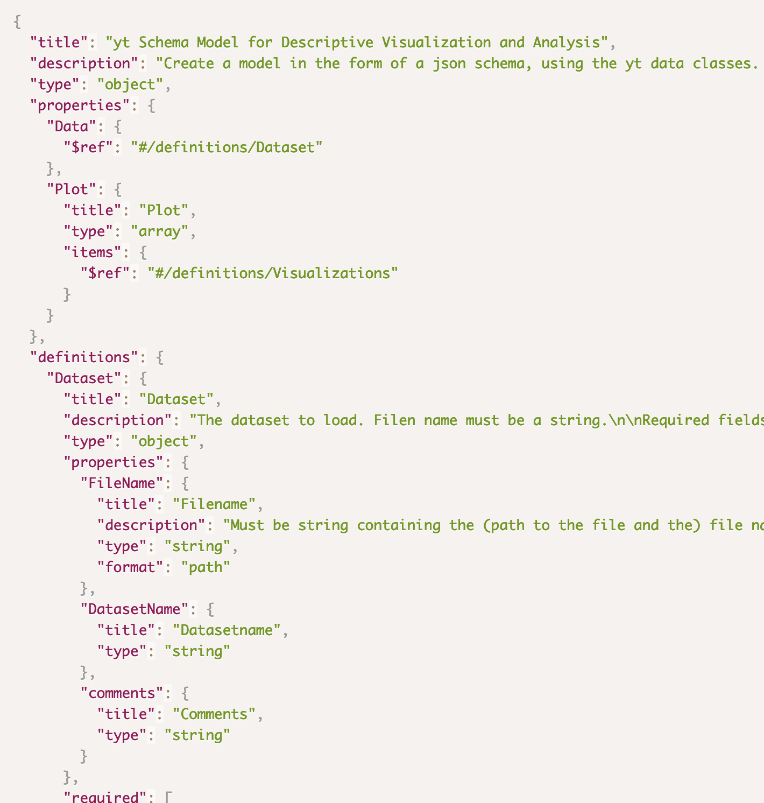
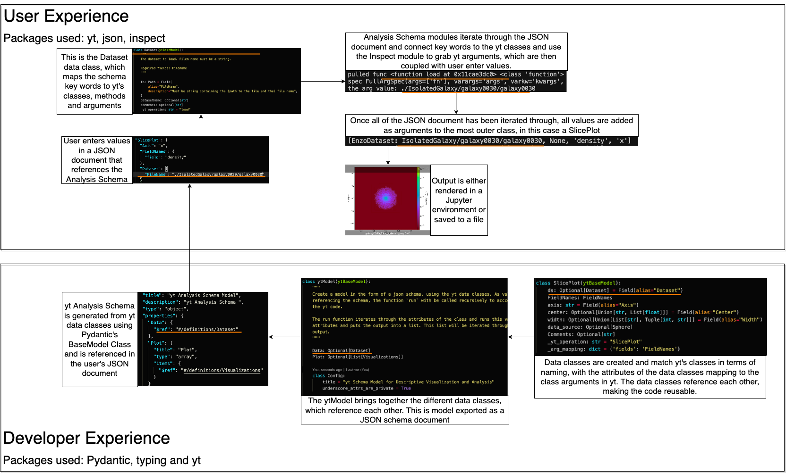
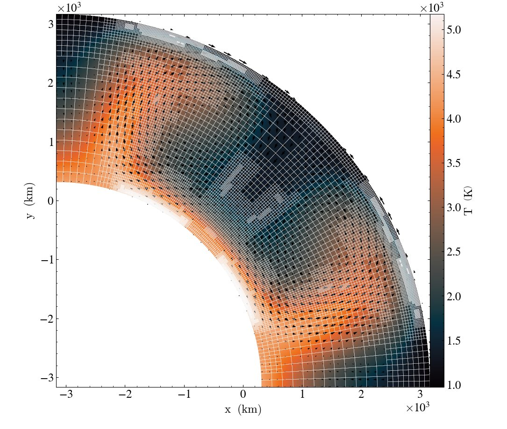

```python

```

# Towards a Scientific Workflow Description: a yt Project Prototype for Interdisciplinary Analysis

### NCSA & iSchool at University of Illinois, University College London
- [yt-project.org](http://yt-project.org/)
- [data-exp-lab.github.io](https://data-exp-lab.github.io/)
- [github.com/yt-project](https://github.com/yt-project/yt/)
- [github.com/data-exp-lab/analysis_schema](https://github.com/data-exp-lab/analysis_schema)

#### Authors: Sam Walkow, Dr. Chris Havlin, Dr. Matthew Turk, Dr. Corentin Cadiou


```python

```

## Table of Contents:
* [The Learning Cliff: Computational Workflows](#first-bullet)
* [Describing Scientific Analysis and Visualization](#second-bullet)
* [What is yt?](#third-bullet)
* [Using JSON as an Interface](#fourth-bullet)
* [The Analysis Schema](#fifth-bullet)
* [Connecting Existing Software to Declarative Description](#sixth-bullet)
* [Supporting Workflows and Software](#seventh-bullet)
* [Future Work](#eighth-bullet)
* [About the Authors](#nineth-bullet)
* [Acknowledgements](#nineth-bullet)

```python

```

### The Learning Cliff: Computational Workflows <a class="anchor" id="first-bullet"></a>

Working with scientific data and open source software requires understanding a myriad of tools and best practices. This paradigms like imperative programming and for loops to write code, and nuances in syntax like dot notation. Once users master that, there's learning the internal functionality of individual packages, which are often domain specific. 

Interdisciplinary work provides an extra barrier in addition to those mentioned above, as new ways of thinking and new tools are added to the work load, butting heads with the domain focused tools available. While discovery and reconfiguration of software tools can be an intersection of creativity and innovation, too often learning curves get in the way and slow research down, or cause the wheel to be reinvented over and over again in each domain. 

**Scientific workflow description provides an alternative to the cognitive overhead of learning a new software package and use of imperative programming paradigms often used with python**. We aim to unite the core aspects of interdisciplinary computational work using common natural science mental models while removing inherent domain-specific workflow and computing language barriers, creating an accessible scientific query environment. **This description is encoded in a JSON schema, accessed by the user through a configuration file, and run using python modules that attach the configuration file to the code which produces output.** 

In this case, 'the code' is [yt](http://yt-project.org/), an open source python library designed for scientific analysis and visualization of volumetric data for the computational astrophysics domain. We use yt, an computational astrophyics tool, to demonstrate how a domain specific software can operate within a descriptive framework. **Future work will include support for multiple python libaries across several domains.** 

Check out our previous work on understanding user mental models in yt here: https://samwalkow.github.io/2020-scipy-poster-domainstories/


```python

```

### Describing Scientific Analysis and Visualization <a class="anchor" id="second-bullet"></a>


|||
| - |- |
|| What does it mean to *describe* a workflow? **We have developed a scientific workflow description prototype, which is divided into three different pieces - the JSON schema, a browser interface for user interaction, and a render-engine that will execute the code**. Using a configuration file which will live in the broswer, users can select actions and add appropriate data for those actions which are controled by the JSON schema. Users can then submit this file to the rendering engine, creating output for their work. <br><br>This creates a flexible, language-agnostic, and structured way for users to explore, analysis and visualize natural science data. It weaves human and language together, in a way that fits with how both human and machine *think* about the data and the program. Our work is currently supporting yt, but the schema could be extended to other python libraries. 
    

```python

```

### What is yt?<a class="anchor" id="third-bullet"></a>

yt (https://yt-project.org/) is an open source python library designed for scientific analysis and visualization of volumetric data from the physical sciences. **The analysis schema is designed to operate on top of yt's existing functionalities, to provide intuitive and flexible access to yt operations.**

Here's some yt visualization examples:

---


</div>

<div class="col">


</div>

---

---

Supernova Ignition Simulation
https://arxiv.org/abs/1807.07579
(Evan O’Connor and Sean Couch, MSU)

</div>

<div class="col">

Predicted Weather Radar from Tornadogenesis Simulation<br/>
Leigh Orf (University of Wisconsin),<br/>
Image Credit: NCSA AVL

</div>

---

```python

```

### Using JSON as an Interface <a class="anchor" id="fourth-bullet"></a>

JSON as an interface allows user's to access properties defined in the JSON schema, and add data that conforms to the schema's specifications, which in turn are submitted to the code behind the interface. **User's only need to understand JSON notation to use the code, or in this case yt. They don't need to know python or yt at all to use those tools in their analysis.** They can simply describe what they want the code to do in the JSON configuration file, and an output is returned.<br><br>**The file is used as its own validation, as  users described objects that make up the workflow are validated against a JSON schema, either at runtime or (in certain code editors) in real time**. Workflows can be unique to the user but conform to a broad, domain specification, which makes work in the analysis schema easy to create and reproduce. 
    
<div>
<div class="col">


    
</div>


```python

```

---

### The Analysis Schema <a class="anchor" id="fifth-bullet"></a>



</div>

<div class="col">

<br>

The analysis schema design provides a structured grammar from which users can describe and tell the story of their data analysis. It's meant to connect with the users understanding of the data, while accessing the code it needs to run the analysis. **The schema has been developed to be flexible so users are free to complete operations in any order, while working in a structured schema which ensures the input to the JSON interface is valid and can be run in code**. This helps eliminate syntax issues, code run out of order issues, and lowers the barrier to usage.

<br>

While the description are separate from yt, the mental model behind the data selection, transformation, and logic remain connected to yt. We change how users can access those operations, but not how yt handles the data it receives. In this way, users are learning how yt thinks and understands data input, while using their domain knowledge to reason with the data and the returned output.

<br>
</div>

**By providing an additional layer between the user and the imperative code, the goal of the Analysis Schema is not to further separate the user from the software, but to bring them closer to together by improving the communication and shared work between human and machine.**

---


```python

```

### Connecting Existing Software to Declarative Description <a class="anchor" id="sixth-bullet"></a>

How does the description reach and run the software? The core pieces of the Analysis Schema are data classes, type hinting, and schema models. Analysis Schema relies on !(Pydantic)[https://github.com/samuelcolvin/pydantic/] to produce the models. **The schema is generated from yt data classes and type annotations, which is then accessed by users to guide and structure their analysis in the JSON interface.** 

Pydantic is the vehicle that converts yt code into a model, which is then saved as a JSON schema that can be reference by the user. Data classes with type hinting allow pydantic to create the building blocks that are referenced over and over again within the schema. 
 
Below is the same Analysis Schema workflow, where the `Dataset` dataclass is highlighted through the diagram:


<br>
<br>


---

```python

```

### Supporting Workflows and Software <a class="anchor" id="seventh-bullet"></a>

**The Analysis Schema is designed to make scientific software easier to use, easier to reproduce, and to create a foundation for a structured, analysis grammar.** Supporting individual workflows is the main goal of the analysis - and so we have developed multiple ways to use the schema: in a Jupyter environment, in the command line, and in the browser. See some example below!

#### Working in Jupyter:

This example is run using VSCode in Jupyter mode, where the output of the user's JSON instructions are displayed in the Jupyter server on the right hand side:

<div align="middle"><video controls src="images/AnalysisSchemaJupyter.mov" align="center" height="600"/></div>


```python

```

#### Working in the command line:

Users can also submit the configuration file through the command line and produce output as image files. 

This example is also run in VSCode, but the file below is submitted through the command line and the output is written to a file instead:
<br>

<div align="middle"> <video controls src="images/AnalysisSchemaCL.mov" height="700"/></div>


```python

```

#### Browsed-based Analysis and Visualization

In addition to Jupyter and command line workflows, we are also working towards a browser environment that allows use of the Analysis Schema without downloading any software. Our goal is to remove hardware barriers to working with open source scientific software: 

<div align="middle"><video controls src="images/schema_browser.mp4" height="550"/></div>


```python

```

### Future Work <a class="anchor" id="eighth-bullet"></a>

#### Beyond yt

Open source scientific software fosters innovation and supports a surge of new tools, which does introduce a sustainability problem. The Analysis Schema is designed to address this problem - any python module can be added to the underlying model, where the Analysis Schema adds that model to the schema. This allows for any packages to be accessed and run in the JSON interface. So users can use JSON sytanx to run any scientific python code.

Here's an example where [napari](https://napari.org/) is accessed through the JSON interface using VSCode and a Jupyter notebook:

<div align="middle"><video controls src="images/schema_napari.mp4" width="800"/></div>


```python

```

#### Beyond Astrophysics

Historically yt was developed for computational astrophysics, and it is our goal to expand yt beyond it's original domain by implementing a domain contexts system. Adding a way for the Analysis Schema to detect and adjust the schema according to the domain the user is working will just users more computational power to answer research questions. 

In the future, we are aiming to expand yt's capabilities to support: 

- __Geophysics__
- __Neuroimaging__
- __Weather__ 
- __Climate__
- __Oceanography__

**Common elements and operations are often used across natural science domains** and we aim to identify and encode those operations into the analysis schema to make yt's visualization and analysis functionality more accessible. 

Operations of analysis and visualization are often reused across domains including:
- Loading and registering data into a coordinate system
- Methods of aggregation
- Methods of transformation
- Methods of plotting

**Once we understand how users from other domains understand and process data, we can add logic to the schema that allow for the language and how yt handles the data to better match what users expect.** 


#### Check out some geoscience visualization and anlaysis with yt:

Mantle convection in a spherical shell calculated with [ASPECT](https://geodynamics.org/cig/software/aspect/). Temperature field overlaid with velocity vectors (black) and adaptively refined mesh (white), visualized with the experimental [yt-aspect frontend](https://github.com/yt-project/yt/pull/3109):

---



</div>

<div class="col">

Additional geoscience visualizations at https://github.com/chrishavlin/AGU2020.

</div>

```python

```

---


## About the Authors <a class="anchor" id="nineth-bullet"></a>

<br>

#### Sam Walkow, Informatics PhD Student at the University of Illinois

#### Contact:
- [@samwalkow](https://twitter.com/SamWalkow)
- swalkow2@illinois.edu

|||
| - |- |
|| Sam Walkow is a PhD student in Informatics interested in open source software sustainability, culture and data visualization. She's investigating these issues by looking at the intersection of human and computer workflows, problem solving and data conception and representation. 

```python
```


#### Chris Havlin, Research Scientist in School of Information Sciences at the University of Illinois

#### Contact:
- [@s_i_r_h_c](https://twitter.com/s_i_r_h_c)
- chavlin@illinois.edu
- [chrishavlin.github.io](https://chrishavlin.github.io/)


|||
| - |- |
|| Chris Havlin is a research scientist in the Data Exploration Lab at the School of Information Sciences at the University of Illinois. His research focuses on cross-domain data visualization and analysis in the physical sciences.

```python
```


#### Matthew Turk, Assistant Professor in School of Information Sciences at the University of Illinois

Matthew Turk is an assistant professor in the School of Information Sciences and also holds an appointment with the Department of Astronomy in the College of Liberal Arts and Sciences. His research is focused on how individuals interact with data and how that data is processed and understood.

At the University of Illinois, he leads the Data Exploration Lab and teaches in Data Visualization, Data Storytelling, and Computational Astrophysics.


#### Contact:

[Matthew Turk dot github dot io](https://matthewturk.github.io/)


```python
```

#### Corentin Cadiou, Postdoctoral Research Assistant at University College London


#### Contact:

- [@cphyc](https://twitter.com/cphyc)
- c.cadiou@ucl.ac.uk
- [cphyc.github.io](https://cphyc.github.io/)

|||
| - |- |
|| Corentin Cadiou is a postdoctoral researcher at the department of Physics and Astrophysics at University College London.
His research focuses on simulating the formation of galaxies in the Universe. To that end, he is interested in exploring novel approaches to data analysis and data processing of numerical simulations.


```python

```

### Acknowledgements <a class="anchor" id="tenth-bullet"></a>

We would like to thank major yt contributors including Nathan Goldbaum, and the larger yt community for their sustained effort.

We would also like to thank the following entities for their support:

- The Gordon and Betty Moore Foundation’s Data-Driven Discovery Initiative through Grant GBMF4561.
- The National Science Foundation under Grants OAC-1663914 and ACI-1535651
- NumFOCUS


```python
%%html
<style>
@import url('https://fonts.googleapis.com/css2?family=Hind+Siliguri&display=swap');
   div.jp-MarkdownOutput {font-family: 'Hind Siliguri', sans-serif; font-size: 130%;}
</style>


```


<style>
@import url('https://fonts.googleapis.com/css2?family=Hind+Siliguri&display=swap');
   div.jp-MarkdownOutput {font-family: 'Hind Siliguri', sans-serif; font-size: 130%;}
</style>


```python

```
