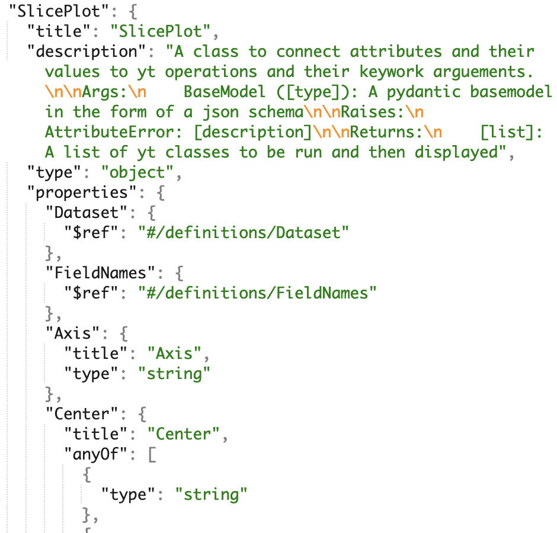

# Towards a Scientific Workflow Description: a yt Project Prototype for Interdisciplinary Analysis

### NCSA & iSchool at University of Illinois, University College London
- [yt-project.org](http://yt-project.org/)
- [data-exp-lab.github.io](https://data-exp-lab.github.io/)
- [github.com/yt-project](https://github.com/yt-project/yt/)
- [github.com/data-exp-lab/analysis_schema](https://github.com/data-exp-lab/analysis_schema)

#### Authors: Sam Walkow, Dr. Chris Havlin, Dr. Matthew Turk, Corentin Cadiou


```python

```

### The Learning Cliff: Computational Workflows

Working with scientific data and open source software requires understanding a myriad of tools and best practices. Analysis and visualization using python and open source relies on paradigms like imperative programming and for loops to write code and nuances in syntax like dot notation. After that, there's learning the internal functionality of individual packages, which are often domain specific. 

Interdisciplinary work provides an extra barrier, as new ways of thinking and new tools are added to the work load, butting heads with the domain focused tools available. While discovery and reconfiguration of software tools can be an intersection of creativity and innovation, too often learning curves get in the way and slow research down, or cause the wheel to be reinvented over and over again in each domain. 

**Scientific workflow description** provides an alternative to the cognitive overhead of learning a new software package and use of imperative programming paradigms often used with python. We aim to unite the core aspects of interdisciplinary computational work using common natural science mental models while removing inherent domain-specific workflow and computing language barriers, creating an accessible scientific query environment. **This description is encoded in a JSON schema, accessed by the user through a configuration file, and run using python modules that attach the configuration file to the code which produces output.** 

In this case, 'the code' is [yt](http://yt-project.org/), an open source python library designed for scientific analysis and visualization of volumetric data from the physical sciences. We use yt, an computational astrophyics tool, to demonstrate how a domain specific software can operate within a descriptive framework. 

Check out our previous work on understanding user mental models in yt here: https://samwalkow.github.io/2020-scipy-poster-domainstories/


```python

```

### Describing Scientific Analysis and Visualization

What does it mean to *describe* a workflow? **We have developed a scientific workflow description prototype, which is divided into three different pieces - the JSON schema, a browser interface for user interaction, and a render-engine that will execute the code**. Using a configuration file which will live in the broswer, users can select actions and add appropriate data for those actions which are controled by the JSON schema. Users can then submit this file to the rendering engine, creating output for their work.  

**Add visual**

This creates a flexible, language-agnostic, and structured way for users to explore, analysis and visualize natural science data. It weaves human and language together, in a way that fits with how both human and machine *think* about the data and the program. Our work is currently supporting yt, but the schema could be extended to other python libraries. 


### What is yt?

yt (https://yt-project.org/) is an open source python library designed for scientific analysis and visualization of volumetric data from the physical sciences. **The analysis schema is designed to operate on top of yt's existing functionalities, to provide intuitive and flexible access to yt operations.**

Here's some yt examples:

    Supernova Ignition Simulation
    https://arxiv.org/abs/1807.07579
    (Evan O’Connor and Sean Couch, MSU)
    


                           

                                                                                 Predicted Weather Radar from Tornadogenesis Simulation
                                                                                                   Leigh Orf (University of Wisconsin),
                                                                                                                 Image Credit: NCSA AVL


#### Using JSON as an Interface

JSON as an interface also user's to access properties defined in the JSON schema, and add data that conforms to the schema's specifications, which in turn are submitted to the code behind the interface. **User's only need to understand JSON notation to use the code, or in this case yt. They don't need to know python or yt at all to use those tools in their analysis.** They can simply describe what they want the code to do in the JSON configuration file, and an output is returned. 

**The file is used as its own validation, as users objects that make up the workflow are validated against a JSON schema, either at runtime or (in certain code editors) in real time**. Workflows can be unique to the user but conform to a broad, domain specification, which makes work in the analysis schema ease to create and reproduce. 

Here's an example using VSCode:


#### The Analysis Schema

The analysis schema design provides a structured grammar from which users can describe and tell the story of their data analysis. It's meant to connect with the users understanding of the data, while accessing the code it needs to run the analysis. **The schema has been developed to be flexible so users are free to complete operations in any order, while working in a structured schema which ensures the input to the JSON interface is valid and can be run in code**. This helps eliminate syntax issues, code run out of order issues, and lowers the barrier to usage. 

While the description are separate from yt, the mental model behind the data selection, transformation, and logic remain connected to yt. We change how users can access those operations, but not how yt handles the data it receives. In this way, users are learning how yt thinks and understands data input, while using description and their domain knowledge to reasoon with the data and the returned output.

**By providing an additional layer between the user and the imperative code, he goal of the analysis schema is not to further separate the user from the software, but to bring them closer to together by improving the communication and shared work between human and machine.**



#### Connecting Existing Software to Declarative Description

How does the description reach and run the software? Data classes, type hinting, and schema models (all using Pydantic) are the core pieces that the analysis schema functions on. The schema is generated from yt data classes and type annotations, which is then accessed by users to guide and structure their analysis in the JSON interface. The JSON schema used for the description contains key words, which are relayed back to the code and used to run the code with user input as arguments. This code is run and output is displayed to the user. 


```python

```

### Domain Contexts - Beyond Astrophysics

Historically yt was developed for computational astrophysics, but we aim to expand yt's capabilities to support: 

- __Geophysics__
- __Neuroimaging__
- __Weather__ 
- __Climate__
- __Oceanography__

**Common elements and operations are often used across natural science domains** and we aim to identify and encode those operations into the analysis schema to make yt's visualization and analysis funcationality more accessable. 

Operations of analysis and visualization are often reused across domains including:
- Loading and registering data into a coordinate system
- Methods of aggregation
- Methods of transformation
- Methods of plotting

Once we understand how users from other domains understand and process data, we can add logic to the schema that allow for the language and how yt handles the data to better match what users expect. 


Check out some Geophsyics visualization and anlaysis with yt:

https://nbviewer.jupyter.org/github/chrishavlin/AGU2020/blob/main/notebooks/cm1_supercell.ipynb

https://github.com/chrishavlin/AGU2020

## About the Authors

#### Sam Walkow, Informatics PhD Student at the University of Illinois

Sam Walkow is a PhD student in Informatics interested in open source software sustainability, culture and data visualization. She's investigating these issues by looking at the intersection of human and computer workflows, problem solving and data conception and representation. 

#### Contact:
- [@samwalkow](https://twitter.com/SamWalkow)
- swalkow2@illinois.edu


#### Chris Havlin

#### Contact:

#### Matthew Turk, Assistant Professor in School of Information Sciences at the University of Illinois

Matthew Turk is an assistant professor in the School of Information Sciences and also holds an appointment with the Department of Astronomy in the College of Liberal Arts and Sciences. His research is focused on how individuals interact with data and how that data is processed and understood.

At the University of Illinois, he leads the Data Exploration Lab and teaches in Data Visualization, Data Storytelling, and Computational Astrophysics.


#### Contact:

[Matthew Turk dot github dot io](https://matthewturk.github.io/)

#### Corentin Cadiou

#### Contact:


```python

```

### Acknowledgements

We would like to thank major yt contributors including Nathan Goldbaum, and the larger yt community for their sustained effort.

We would also like to thank the following entities for their support:

- The Gordon and Betty Moore Foundation’s Data-Driven Discovery Initiative through Grant GBMF4561.
- The National Science Foundation under Grants OAC-1663914 and ACI-1535651
- NumFOCUS


```python
# %%html
# <style>
# @import url('https://fonts.googleapis.com/css?family=Nanum%20Gothic&display=swap');
#    div.jp-MarkdownOutput {font-family: "Nanum Gothic"; font-size: 200%;}
# </style>


```


```python

```
